# Easy Baking 

Easy baking's website provides its users with delicious baking recipes that are well structured and easy to follow. Easy Baking is highlightning the Swedish concept of "fika" and gives a broad insight in its meaning - gathering to enjoy pastry and coffee/tea. The site is targeting anyone who has the desire to bake and want some inspiration.
[Here](https://saratisell.github.io/easy-baking/) can you view the site.

## Design

### Color scheme

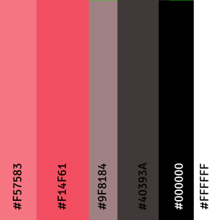

### Typography

Sans-serif fonts were imported from Google Fonts
The choosen fonts will give advantage for the site due to its clean look due and its accessibility.
 
* Voltaire - Headings and Menu
* Signika - Paragraps

### Wireframes

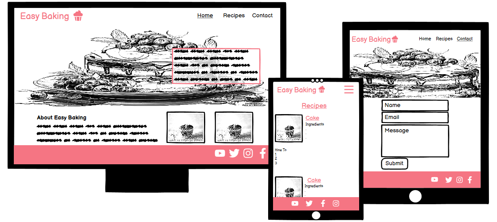

## Features

### Site Wide

#### Navigation

The header will contain the sites main navigation for an good user experience
  * Logo will be clickable and linked to the home page.
  * Menu will contain links to Home page, Recipes page and Contact page.
  * This will give the user easy navigation thorug all pages.

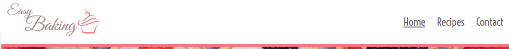

#### Footer

  * Will contain links to social media websites that will be displayed with icons, and provided with aria labels in order to increase accessibility.
  * All links will will be opened in a new tab, to avoid users leaving the site.

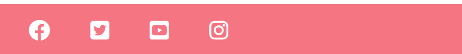

#### Favicon

  * A favicon with the same cupcake-design that shows in the logotype will be added to increase the users experience and make it easier to recognise the site if they have several tabs open.

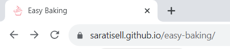

#### 404 Page

* A 404 page will be implemented and designed to match the genral design of the site.
* If a user navigates to a broken link will the 404 page appear and give the user easy access back to the home page.

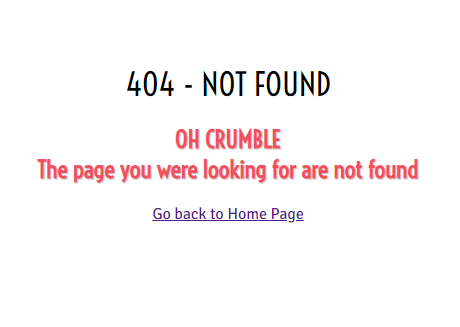

#### The Home Page

* Will contain a short and consist description what the user can expect from the site.
* The user will find some tips for their baking, regarding flavour combinations and they will be able to read about the 'Fika' concept.

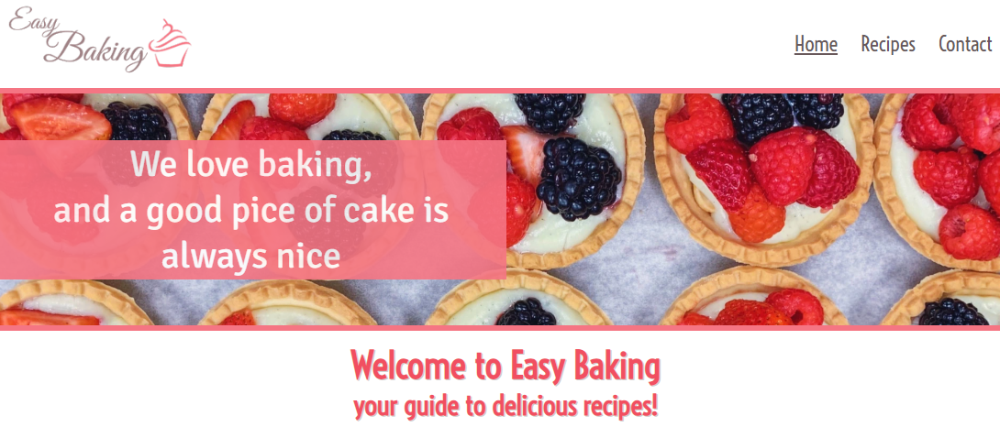
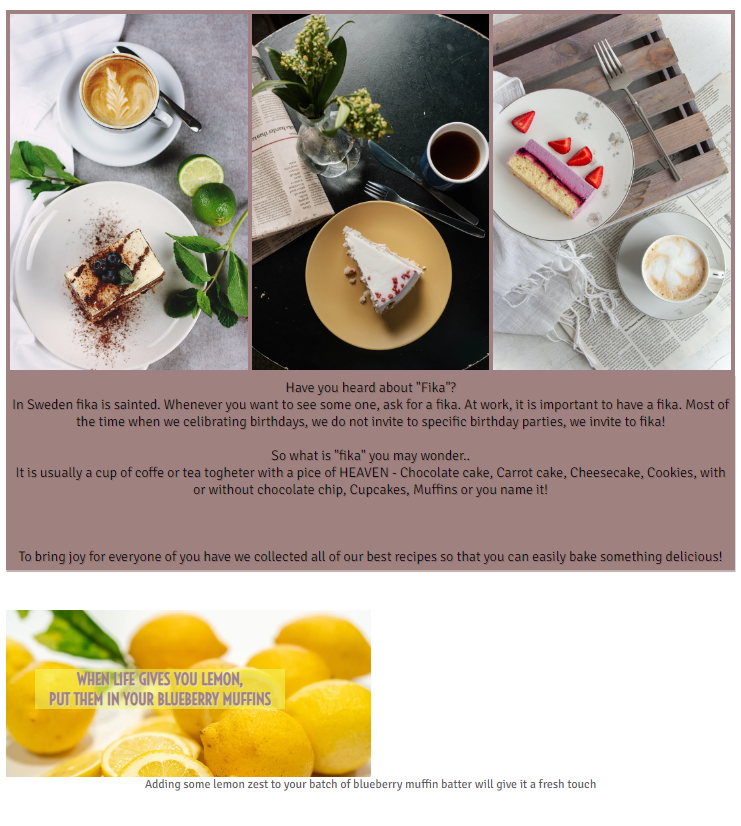

#### The Recipes Page

* Will contain six different recipies with proper description for ingredients and a detailed description how to make it.
* The goal of the varierity is to gain an opportunity to offer something for every user.

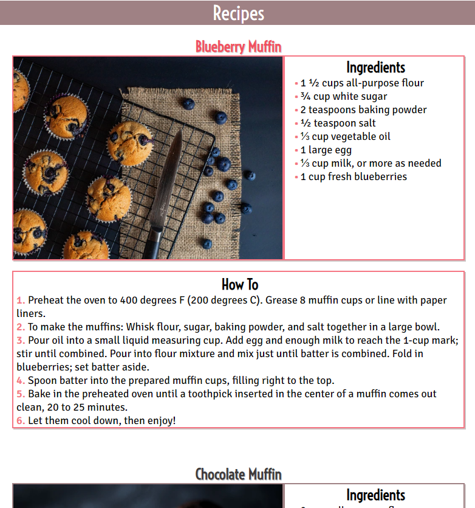

#### The Contact Page

Will contain a contact form that allowes users to contact Easy Baking regarding any questions or thoughts they may have.  
 The form will include the following fields, required:
 * First Name
 * Last Name
 * Email Address
 * Message

* All fields will be required.
* When the contact form have been succesfully submitted the user will be navigated to thanks.html that shows a 'Thank you message'
* A meta tag will be implemented on thanks.html to atomatically send the user back to home page after 10 secunds.

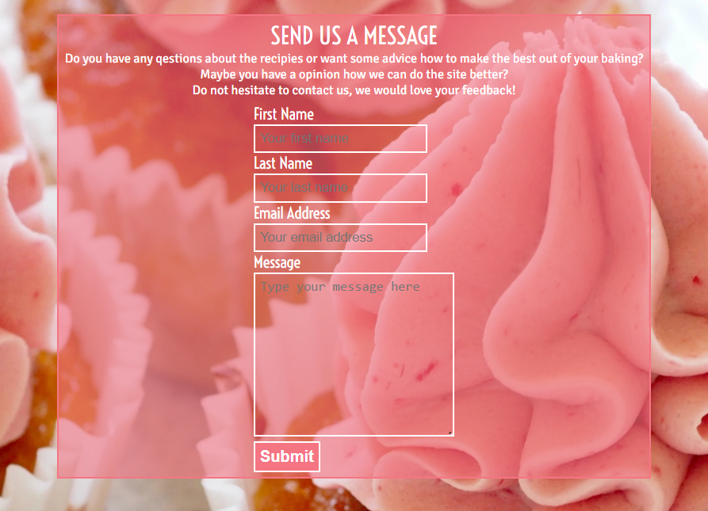
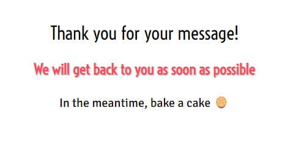

#### Features

##### Existing

* Responsive design
* Easy navigation and well structured
* 6 well described recipes
* Contact form and Thank you page

##### Future

* Reduce the visible content for 'How To' on recipes to let the user decide when to show and hide a section.
* Add more recipes.
* Add videos showing how to make the recepies in favour to the users that may need more instructions than just text.
* Implement a chat forum for the visitors to use to interact with eachother
  * A session based chat, no need for sign up
  * Where ideas and thoughts can be exchanged
  

## Technologies Used
 
 * HTML
   * The main language to develope the structure of the website
* CSS
   * All styling for the website was written with custom CSS in style.css
* Codeanywhere
  * IDE used to develope the website  
* GitHub
  * To source code and deploy using Git Pages
* Git
  * Used to commit and push code from IDE during the development
* Balsamiq
  * https://balsamiq.com/wireframes/desktop/# Used to design wireframes 
* Canva
  * https://www.canva.com/ Used to design logo, favicon and resize images
* Favicon.io 
  * <https://favicon.io/favicon-converter/>  Used to create favicon files  
* Freeconverter.com
  * <https://www.freeconvert.com/png-to-webp> Used to convert png images to webp
* Pixelied.com
  * https://pixelied.com/convert/png-converter/png-to-webp Used to convert png images to webp
* Font Awesome 
  * <https://fontawesome.com/> Used to implement icons 
* Google Fonts
  * https://fonts.google.com/ Used to import fonts

 

### Languages

* HTML
  * To develope website structure
* CSS
  * To ive the website custom styling

## Testing

## Deployment

## Credits

Code
Content
Media