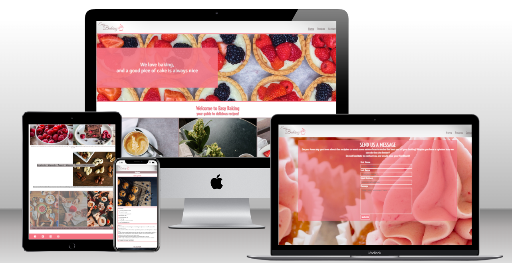

# Easy Baking 

Easy baking's website provides its users with delicious baking recipes that are well structured and easy to follow.
The site is targeting everyone that has the desire to bake. 

## Design

### Color scheme

### Typography

### Wireframes

## Features

### Navigation

### The Header

The header contains the man navigation for the website. The logo contains a link directly to the home page that works through all the sites pages. In the header is the menu found where the visitors can navigate too all pages on the site - Home, Recipes and contact page.

### The Home Page

The home page contains example pictures and short description of the different recipes that can be found on the website.

### The Recipes Page

Here can the visitors find the 6(?) recipes for baking. 
The recipies contains all igridients and how much of each ingridient togheter with the steps that should be followed to make it.

### The Contact Page

The contact page will give the visitors an opportunity to fill in a form to send us a question about the recipes or something similar.

### The Footer

The footer contains social media links.
## Technologies Used

### Languages

Html & Css

### Framework, Libraries & Program Used

Code anywhere
Github
Balsamiq
Favicon.io
Canva
Google fonts
Font Awesome

## Deployment

## Testing

## Credits

Code
Content
Media